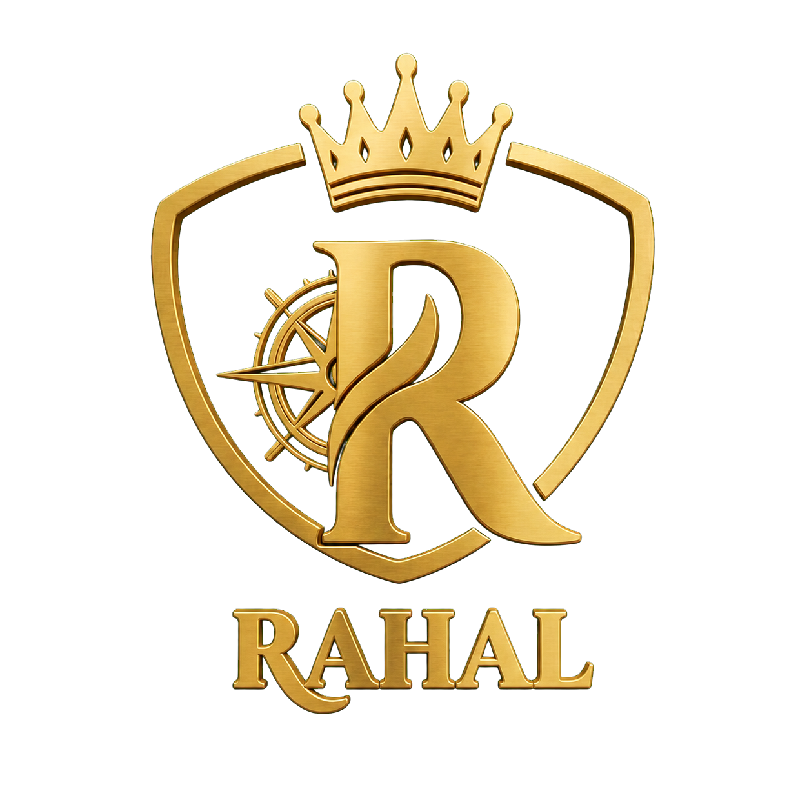
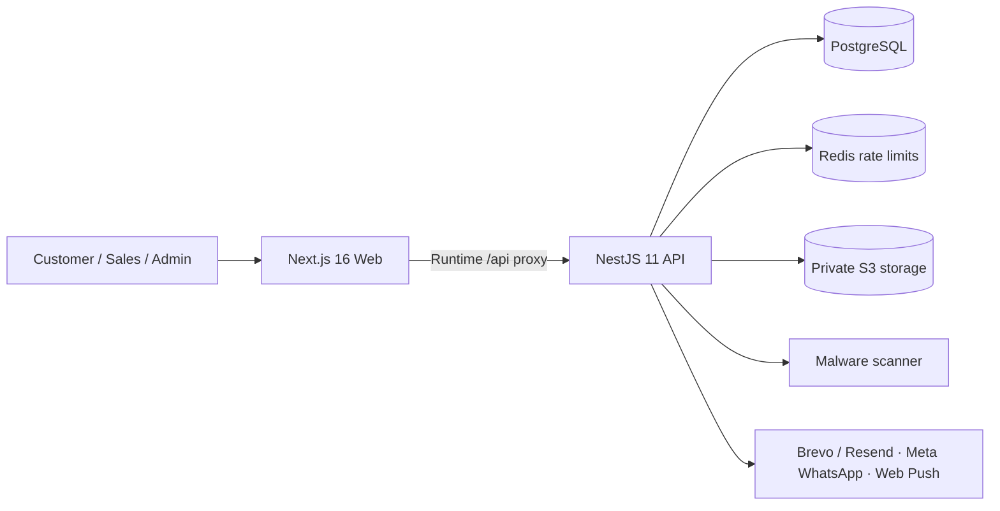

<p align="center">
  
</p>

<h1 align="center">RAHAL | رحّال</h1>

<p align="center">
  <strong>A premium bilingual car-rental experience, built for the way rentals actually work in Egypt.</strong>
  <br />
  تجربة راقية ثنائية اللغة لإدارة طلبات وتأجير السيارات في مصر.
</p>

<p align="center">
  
  
  
  
  
  
</p>

<p align="center">
  <a href="#-what-is-rahal">Overview</a> •
  <a href="#-the-rental-journey">Journey</a> •
  <a href="#-platform-experience">Experience</a> •
  <a href="#-architecture">Architecture</a> •
  <a href="#-run-locally">Run locally</a>
</p>


## ✦ What is RAHAL?

RAHAL is not a simple “book a car” form. It is an end-to-end reservation-request and
branch-operations platform for customers, sales employees, and administrators.

It combines a cinematic public experience with the operational controls needed to review
requests, protect identity documents, record branch deposits, sign rental contracts, manage
vehicle availability, and keep every important action auditable.

> **A submitted request is not a confirmed booking.** Final confirmation happens only after
> sales review, branch attendance, an EGP deposit, and signed rental documents.

### Product principles

- 🇪🇬 Built for Egypt, with **EGP only**.
- 🏢 Pickup and return happen at the **RAHAL branch**.
- 💳 **No online payment** and no misleading instant-confirmation flow.
- 🌐 Arabic is first-class RTL; English is first-class LTR.
- 🔐 Identity numbers, storage keys, and customer documents are never exposed publicly.
- 📱 Responsive interaction and motion across mobile and desktop.

## ✦ The rental journey

```text
Explore fleet
    ↓
Check dates and availability
    ↓
Create a secure reservation request
    ↓
Sales employee claims and reviews the request
    ↓
Customer responds to notes or alternatives when needed
    ↓
48-hour pre-approval
    ↓
Branch attendance + EGP deposit + signed contract
    ↓
Final confirmation → delivery → return → completion
```

Every transition is guarded by business rules. Vehicle availability is checked again before
confirmation, and the final booking receives an immutable EGP price snapshot.

## ✦ Platform experience

| Customer                         | Sales employee                | Administrator                 |
| -------------------------------- | ----------------------------- | ----------------------------- |
| Bilingual fleet discovery        | Atomic request claiming       | Operations overview           |
| Availability search              | Protected document review     | Fleet and vehicle management  |
| Guided reservation request       | Customer-visible conversation | Branch management             |
| Secure document upload           | Alternatives and pre-approval | Staff, roles, and permissions |
| Request timeline and status      | Branch deposit and attendance | Policy publication center     |
| Profile and notification choices | Signed-contract workflow      | Audit and access oversight    |
| Completed-rental reviews         | Delivery and return lifecycle | Review moderation             |

### Communication without noise

RAHAL has an idempotent transactional outbox for:

- In-app notifications
- Transactional email through Brevo with Resend fallback
- WhatsApp through approved Meta templates
- Browser Web Push

For staging phone verification, the API can use Twilio Verify over WhatsApp. Twilio creates and
checks the one-time code; Rahal stores only an expiring provider marker. Trial Twilio accounts can
reach only numbers verified in Twilio. Production request notifications continue to require the
official Meta WhatsApp Business integration and approved authentication/notification templates.

Vercel deployments use request-driven outbox draining after mutations plus a protected daily
recovery sweep. Persistent Node deployments keep the interval worker. Administrators can see safe
provider readiness, aggregate delivery counters, queue health, and run a bounded audited delivery
batch from the Communications center.

Customer preferences, verification state, retry limits, and Cairo quiet hours are respected.
Essential in-app messages remain available even when optional channels are disabled.

## ✦ Architecture



```text
apps/
├── web/          Next.js public experience and role-based workspaces
└── api/          NestJS REST API and background services

packages/
├── database/     Prisma schema, migrations, and PostgreSQL client
├── contracts/    Shared API and domain contracts
├── ui/           Shared design primitives and brand tokens
└── config/       Shared TypeScript configuration
```

## ✦ Security by design

- Memory-hard `scrypt` password hashing
- Opaque HTTP-only browser sessions; only token hashes are stored
- Mandatory TOTP MFA and temporary-password replacement for staff
- AES-GCM encryption for MFA secrets and push subscriptions
- Private S3-compatible document storage with opaque object keys
- File signatures, size limits, and fail-closed malware scanning
- Reason-gated, audited, non-cacheable document access
- Shared Redis authentication throttling in production
- Request IDs, structured errors, CSP, HSTS, and restrictive browser headers
- Privacy-minimized customer, review, and audit responses

Production configuration fails closed when required security providers are missing.

## ✦ Run locally

### Requirements

- Node.js 22+
- pnpm 11.7+
- Docker Desktop

```bash
cp .env.example .env
docker compose up -d
pnpm install --frozen-lockfile
pnpm db:migrate
pnpm db:seed
pnpm dev
```

| Service    | Local address                      |
| ---------- | ---------------------------------- |
| Web        | `http://localhost:3000`            |
| API health | `http://localhost:4000/api/health` |
| PostgreSQL | `127.0.0.1:5433`                   |

## ✦ Quality gate

```bash
pnpm format:check
pnpm lint
pnpm test
pnpm typecheck
pnpm build
pnpm audit
```

The repository also includes a GitHub Actions quality gate, production Docker images,
database migrations, runtime readiness checks, and backup, restore, deployment, and rollback
runbooks.

## ✦ Documentation

- [Project requirements](docs/PROJECT_REQUIREMENTS.md)
- [Architecture](docs/ARCHITECTURE.md)
- [Database schema](docs/DATABASE_SCHEMA.md)
- [Implementation plan](docs/IMPLEMENTATION_PLAN.md)
- [Release readiness](docs/RELEASE_READINESS.md)
- [Deployment and rollback](docs/DEPLOYMENT_RUNBOOK.md)
- [Backup and restore](docs/BACKUP_RESTORE_RUNBOOK.md)
- [Design-reference policy](design-reference/README.md)

## ✦ Release status

The application code, tests, production builds, and container smoke tests are complete for the
current documented scope. Real launch remains intentionally gated on approved legal copy,
production fleet and branch data, provider credentials, staging acceptance, and owner sign-off.
See [Release readiness](docs/RELEASE_READINESS.md) for the authoritative checklist.

---

<p align="center">
  <strong>RAHAL | رحّال</strong><br />
  Premium mobility, grounded in real operations.
</p>
